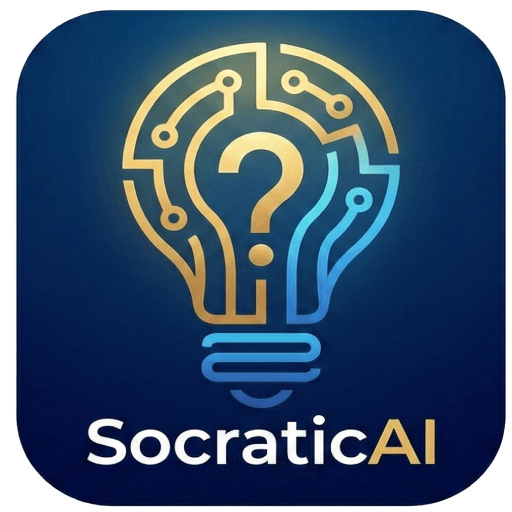

# 🏛️ SocraticAI
> Ένας AI Βοηθός Διδασκαλίας που χρησιμοποιεί τη Σωκρατική Μέθοδο για την τάξη.


*(Μπορείς να βάλεις εδώ ένα screenshot της εφαρμογής αργότερα)*

Το **SocraticAI** είναι μια Web εφαρμογή που επιτρέπει στους εκπαιδευτικούς να δημιουργούν εικονικές τάξεις όπου οι μαθητές (ατομικά ή σε ομάδες) συνομιλούν με έναν AI Tutor. Ο εκπαιδευτικός ορίζει τους κανόνες, το ύφος και τον στόχο της διδασκαλίας, ενώ παρακολουθεί ζωντανά (Live Monitoring) την πρόοδο όλων των ομάδων.

## ✨ Δυνατότητες

### 👨‍🏫 Για τον Εκπαιδευτικό (Teacher Dashboard)
* **Structured Prompting:** Ορισμός της συμπεριφοράς του AI μέσω 5 στοχευμένων πεδίων:
    1.  Θέμα & Ρόλος
    2.  Επίπεδο Μαθητών (Τάξη)
    3.  Παιδαγωγικός Στόχος
    4.  Μέθοδος (π.χ. Σωκρατική)
    5.  Αυστηροί Κανόνες & Περιορισμοί
* **Live Monitoring:** Πίνακας ελέγχου σε πραγματικό χρόνο για την παρακολούθηση των συνομιλιών όλων των ομάδων ταυτόχρονα.
* **Secure API Key:** Ασφαλής αποθήκευση του Gemini API Key τοπικά (Local Storage) χωρίς να εκτίθεται στον server.
* **Grid Layout:** Μοντέρνο περιβάλλον εργασίας βελτιστοποιημένο για Desktop/Laptop.

### 🎓 Για τον Μαθητή / Ομάδες
* **Εύκολη Σύνδεση:** Είσοδος με κωδικό δωματίου (Room Code) και Όνομα Ομάδας.
* **Context Aware:** Το AI "θυμάται" τη συνομιλία για να παρέχει ουσιαστικές απαντήσεις.
* **Modern UI:** Φιλικό περιβάλλον συνομιλίας (Chat Interface) τύπου Messenger.
* **Multilingual:** Πλήρης υποστήριξη Ελληνικών και Αγγλικών.

## 🛠️ Τεχνολογίες

Το project έχει κατασκευαστεί με **Vanilla JavaScript** (χωρίς frameworks) για μέγιστη ταχύτητα και απλότητα.

* **Frontend:** HTML5, CSS3 (Grid/Flexbox), JavaScript (ES6 Modules).
* **Backend / Database:** [Firebase Firestore](https://firebase.google.com/) (Realtime Database).
* **AI Model:** [Google Gemini API](https://ai.google.dev/).
* **Deployment:** GitHub Pages / Firebase Hosting (PWA Compatible).

## 🚀 Εγκατάσταση & Εκτέλεση

### 1. Κλωνοποίηση (Clone)
```bash
git clone [https://github.com/ΤΟ_ΟΝΟΜΑ_ΣΟΥ/SocraticAI.git](https://github.com/ΤΟ_ΟΝΟΜΑ_ΣΟΥ/SocraticAI.git)
cd SocraticAI
